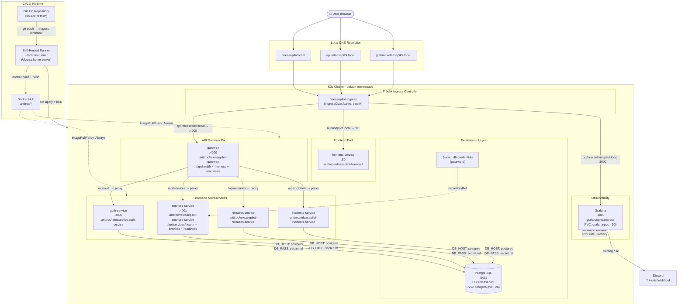

<div align="center">

# ReleasePilot

**A Kubernetes-native microservice operations dashboard — built to give engineering teams a single pane of glass for deployment health, live incident tracking, and service fleet status.**

[](https://reactjs.org/)
[](https://www.typescriptlang.org/)
[](https://nodejs.org/)
[](https://expressjs.com/)
[](https://www.postgresql.org/)
[](https://kubernetes.io/)
[](https://grafana.com/)
[](https://github.com/features/actions)
[](https://www.docker.com/)
[](https://traefik.io/)

</div>

---

## What Is ReleasePilot?

ReleasePilot is a production-grade, Kubernetes-native dashboard that surfaces release history, service health, and incident timelines in one place. Instead of context-switching between Grafana, GitHub, and Notion after a bad deploy, your team gets a unified ops interface with live fleet status, structured incident records, and automated alerting — all running on a real K3s cluster with zero-downtime deployments and persistent storage.

This project was built as a full DevOps portfolio piece: microservices architecture, Kubernetes orchestration, CI/CD pipelines, Prometheus/Grafana observability, and a self-hosted deployment strategy.

---

## Architecture



---

## Key Features

### Zero-Downtime Hot-Swap Deployments
Every service uses `imagePullPolicy: Always` combined with rolling update strategy. A `git push` to `main` triggers the CI/CD pipeline, builds a fresh Docker image, and Kubernetes rolls it out without dropping traffic. The gateway and all backend services are fully replaceable at runtime.

### Kubernetes Liveness & Readiness Probes
All pods ship with battle-hardened health checks. The API Gateway answers both `/api/health` and `/api/api/health` for dual-probe compatibility. The Services microservice exposes `/api/services/health`. Kubernetes will automatically restart any pod that fails its liveness threshold and will withhold traffic from pods that are not yet ready — eliminating cold-start errors from reaching users.

### Persistent Storage for Stateful Workloads
PostgreSQL is backed by a `PersistentVolumeClaim` (`postgres-pvc`, 2Gi, `local-path` storage class) with `PGDATA` explicitly set to `/var/lib/postgresql/data/pgdata`. Grafana dashboards and datasources survive pod reschedules via their own PVC (`grafana-pvc`, 2Gi). A bare host reboot will not wipe application state.

### Automated Alerting Pipeline
Grafana monitors container-level metrics scraped from the K3s cluster: request rate, error rate, P95 latency, pod restart counts, and service health signals. Configured alerting rules fire webhooks directly to Discord, giving your team async notifications without a third-party SaaS dependency.

### Transparent Reverse Proxy Gateway
The API Gateway proxies all downstream service traffic while fully preserving the original request URL — no path rewriting, no double-prefix bugs. This design ensures frontend route expectations match backend service contracts exactly, which matters when routes like `/api/services/health` must survive the full proxy chain intact.

### Kubernetes Secrets for Credential Isolation
Database credentials are injected into pods via a Kubernetes Secret (`db-credentials`) using `secretKeyRef`. No plain-text passwords live in running containers or committed YAML. Services receive credentials as environment variables at startup.

---

## Architecture Overview

| Layer | Technology | Detail |
|---|---|---|
| Frontend | React + TypeScript | Glassmorphic dashboard UI, Material UI design tokens |
| API Gateway | Node.js + Express | Reverse proxy, service routing, health aggregation |
| Auth Service | Node.js + Express + bcrypt | JWT-based authentication, password hashing |
| Services API | Node.js + Express + PostgreSQL | Fleet catalog, service metadata, health scoring |
| Releases Service | Node.js + Express + PostgreSQL | Deployment history, version tracking |
| Incidents Service | Node.js + Express + PostgreSQL | Incident timeline, severity classification |
| Database | PostgreSQL 15 | Shared relational store, PVC-backed persistence |
| Ingress | Traefik (K3s built-in) | Host-based routing for 3 virtual hosts |
| Observability | Grafana OSS | Cluster metrics, dashboards, Discord alerting |
| Container Registry | Docker Hub (`arittroc/*`) | All service images |
| Orchestration | K3s (Kubernetes) | Single-node cluster on Ubuntu home server |
| CI/CD | GitHub Actions | Self-hosted runner, automated build + deploy |

---

## Local Development (Quick Start)

### Prerequisites

You will need the following installed on your Ubuntu server or local machine:

- [Docker](https://docs.docker.com/get-docker/) + Docker Compose plugin
- [kubectl](https://kubernetes.io/docs/tasks/tools/)
- [K3s](https://k3s.io/) (or any Kubernetes distribution with Traefik)

### 1. Clone the repository

```bash
git clone https://github.com/arittroc/releasepilot.git
cd releasepilot
```

### 2. Create the database credentials secret

```bash
kubectl create secret generic db-credentials \
  --from-literal=password=<YOUR_DB_PASSWORD>
```

### 3. Apply all Kubernetes manifests

```bash
kubectl apply -f k8s/services-service.yaml
kubectl apply -f k8s/gateway.yaml
kubectl apply -f k8s/grafana.yaml
kubectl apply -f k8s/ingress.yaml
```

Verify all pods come up healthy:

```bash
kubectl get pods
kubectl get services
```

### 4. Configure local DNS

Add the following entries to your `/etc/hosts` file (or `C:\Windows\System32\drivers\etc\hosts` on Windows), replacing `<YOUR_UBUNTU_SERVER_IP>` with your K3s node's LAN address:

```
<YOUR_UBUNTU_SERVER_IP>   releasepilot.local
<YOUR_UBUNTU_SERVER_IP>   api.releasepilot.local
<YOUR_UBUNTU_SERVER_IP>   grafana.releasepilot.local
```

### 5. Access the application

| Service | URL |
|---|---|
| Dashboard | http://releasepilot.local |
| API Gateway | http://api.releasepilot.local |
| Grafana | http://grafana.releasepilot.local |

Default Grafana credentials: `admin` / `admin`

---

## Production CI/CD & Infrastructure

### Deployment Strategy

ReleasePilot uses a **GitHub Self-Hosted Runner** installed on the private Ubuntu home server to power its CI/CD pipeline. Because the server sits behind a NAT router with no inbound port forwarding, a cloud-hosted runner (GitHub-managed) cannot SSH into it. The self-hosted runner flips this model: the server reaches out to GitHub and polls for jobs, then executes builds and deploys entirely on-premise.

**Pipeline flow:**

```
git push → GitHub Actions (self-hosted runner) → Docker Hub → kubectl apply → K3s rolling update
```

The runner is installed at `~/actions-runner` on the Ubuntu server — **outside the project repository** to prevent runner internals (`_work/`, `_diag/`) from accidentally being staged and pushed.

### Setting Up Your Own Runner (for forks)

If you fork this repository, you need to provision your own self-hosted runner:

1. Go to your forked repo → **Settings → Actions → Runners → New self-hosted runner**
2. Follow GitHub's download and configure instructions on your Ubuntu server:

```bash
# Run on your server (replace token with the one GitHub provides)
mkdir ~/actions-runner && cd ~/actions-runner
curl -o actions-runner-linux-x64-<version>.tar.gz -L <github_download_url>
tar xzf ./actions-runner-linux-x64-<version>.tar.gz
./config.sh --url https://github.com/<YOUR_USERNAME>/releasepilot --token <YOUR_RUNNER_TOKEN>
```

3. Install as a persistent systemd service so the runner survives reboots:

```bash
sudo ./svc.sh install
sudo ./svc.sh start
```

4. Verify the runner shows as **Idle** in your GitHub repo's Actions → Runners settings page.

### Required GitHub Secrets

Navigate to **Settings → Secrets and variables → Actions** and add the following repository secrets:

| Secret Name | Description |
|---|---|
| `DOCKER_USERNAME` | Your Docker Hub username (e.g. `arittroc`) |
| `DOCKER_PASSWORD` | Your Docker Hub access token (not your account password) |

> **Security note:** Always use a Docker Hub **access token** scoped to `Read & Write` rather than your account password. Tokens can be rotated or revoked independently without changing your login credentials.

### Adding Your Server to the Workflow

When your runner is configured, the `.github/workflows/deploy.yml` file targets it with:

```yaml
jobs:
  deploy:
    runs-on: self-hosted
```

Any `kubectl apply` commands in the workflow will execute directly on your server where K3s is running. No VPN, no port forwarding, no cloud infrastructure required.

### .gitignore — Runner Isolation

The following entries must exist in your `.gitignore` to prevent runner internals from being staged:

```gitignore
_work/
_diag/
actions-runner/
```

> **Lesson learned:** A `git add .` from inside the project directory while the runner was co-located staged runner state files containing plain-text operational secrets. GitHub Push Protection correctly rejected the push. The runner was moved to `~/actions-runner` and the repo boundary was hardened with these `.gitignore` entries.

---

## Observability

Grafana is pre-deployed at `grafana.releasepilot.local` with a 2Gi persistent volume. Connect it to your K3s metrics by adding Prometheus as a datasource inside Grafana, pointed at the in-cluster Prometheus endpoint.

The following signals are tracked:

- **Request rate** per service (reqs/sec)
- **Error rate** (5xx ratio)
- **P95 latency** per route
- **Pod restart count** (canary for crash loops)
- **Service health status** (liveness probe pass/fail rate)

Alert rules fire to Discord via webhook when error rate or restart count exceeds threshold.

---

## Post-Mortem: Infrastructure Hardening

This project survived a production-class incident: a host power outage exposed that PostgreSQL was running on ephemeral pod storage. The recovery involved:

1. Rebuilding database schemas from inside running pods via `kubectl exec`
2. Repairing a schema mismatch (`password` vs `password_hash`) that caused bcrypt crashes
3. Fixing frontend crashes caused by integer IDs where string IDs were expected
4. Repairing a double-prefix routing bug in the API Gateway (`/api/api/health`)
5. Recovering from a GitHub push rejection caused by runner files being staged
6. Reinstalling the self-hosted runner outside the project repo
7. Attaching a PersistentVolumeClaim to PostgreSQL with correct `PGDATA` configuration

The full post-mortem is documented in [`devopsari/ReleasePilot/ReleasePilot - Kubernetes Post-Mortem & Infrastructure Hardening.md`](devopsari/ReleasePilot/ReleasePilot%20-%20Kubernetes%20Post-Mortem%20%26%20Infrastructure%20Hardening.md).

---

## Project Status

| Component | Status |
|---|---|
| Frontend Dashboard | Stable |
| API Gateway | Stable |
| Auth Service | Stable |
| Services API | Stable |
| Releases Service | Stable |
| Incidents Service | Stable |
| PostgreSQL (with PVC) | Stable |
| Grafana (with PVC) | Stable |
| Traefik Ingress | Stable |
| CI/CD Pipeline | Stable |

---

## License

MIT
